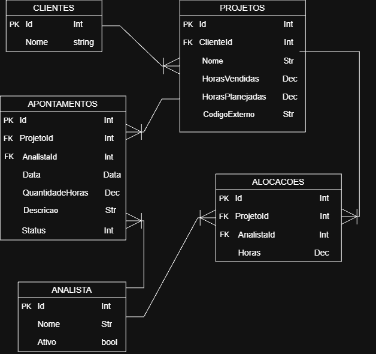
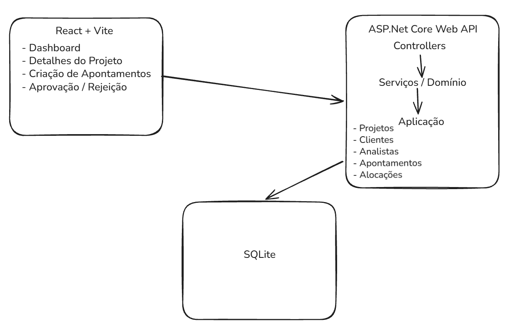

# 📊 Painel de Projetos PVT

Sistema para acompanhamento da situação de projetos com base em horas planejadas, horas vendidas e horas realizadas.

A proposta não foi construir um sistema completo de gestão de projetos. O foco foi modelar o domínio, implementar as principais regras de negócio e entregar uma aplicação funcional de ponta a ponta, com backend, API e interface web.

---

# ✨ Funcionalidades

- Listagem dos projetos com seus principais indicadores
- Consulta detalhada de um projeto
- Visualização dos apontamentos vinculados ao projeto
- Criação de novos apontamentos
- Aprovação ou rejeição de apontamentos pendentes
- Atualização automática dos indicadores após a aprovação de um apontamento
- Classificação do projeto como **Saudável**, **Atenção** ou **Crítico**
- Feedback visual de carregamento, sucesso e erro nas principais operações

---

# 📋 Regras de Negócio

- Cada projeto pertence a um cliente.
- Um projeto possui horas vendidas e horas planejadas.
- Apenas analistas ativos podem registrar apontamentos.
- A quantidade de horas deve ser maior que zero.
- Todo novo apontamento começa como `Pendente`.
- Apenas apontamentos `Aprovados` entram no cálculo das horas realizadas.
- Um apontamento pendente pode ser aprovado ou rejeitado.
- Depois de aprovado ou rejeitado, ele não pode ter o status alterado novamente.

## Saúde do projeto

O projeto é analisado por dois indicadores:

- **Consumo planejado:** horas realizadas / horas planejadas
- **Consumo contratado:** horas realizadas / horas vendidas

| Status   | Regra                                |
| -------- | ------------------------------------ |
| Saudável | Os dois consumos estão abaixo de 90% |
| Atenção  | Pelo menos um consumo chegou a 90%   |
| Crítico  | Pelo menos um consumo chegou a 100%  |

Os valores de 90% e 100% representam regras iniciais do case. Em um sistema real, esses limites poderiam ser configuráveis por projeto ou contrato.

---

# 🏛 Modelagem

O domínio possui cinco entidades principais:

```text
Cliente
   └── Projetos

Projeto
   ├── Cliente
   ├── Alocações
   └── Apontamentos

Analista
   ├── Alocações
   └── Apontamentos
```

## Cliente

Representa a empresa dona do projeto.

## Projeto

É a entidade principal do sistema.

Guarda informações como cliente, horas vendidas, horas planejadas e os apontamentos realizados.

Separei `HorasVendidas` de `HorasPlanejadas` porque representam conceitos diferentes:

- **Horas vendidas:** representam o limite contratado pelo cliente.
- **Horas planejadas:** representam a estimativa interna de esforço para executar o projeto.

Essa separação permite responder duas perguntas diferentes:

- Estamos consumindo mais esforço do que o planejado?
- Estamos próximos de consumir todas as horas contratadas?

## Analista

Representa quem trabalha nos projetos e registra os apontamentos.

## Alocação

Representa a participação planejada de um analista em um projeto.

Ela ainda não influencia diretamente os indicadores do sistema. Foi mantida na modelagem porque poderia ser utilizada futuramente para análises de capacidade, disponibilidade e sobrecarga dos analistas.

## Apontamento

Representa um registro de horas trabalhadas em um projeto.

O fluxo de status é:

```text
Pendente
   ├── Aprovado
   └── Rejeitado
```

Somente apontamentos aprovados entram no cálculo das horas realizadas e, consequentemente, nos indicadores do projeto.

## Modelo do Banco de Dados



---

# 🛠 Tecnologias

## Backend

- ASP.NET Core Web API (.NET 9)
- Entity Framework Core 9
- SQLite
- Swagger / Swashbuckle

## Frontend

- React
- TypeScript
- Vite
- CSS puro

---

# 📂 Estrutura do Projeto

```text
painel-projetos-pvt/
│
├── src/
│   └── PainelProjetosPVT.Api/
│       ├── Aplicacao/
│       │   ├── DTOs/
│       │   └── Servicos/
│       │
│       ├── Controllers/
│       │
│       ├── Dominio/
│       │   ├── Entidades/
│       │   └── Enums/
│       │
│       └── Infraestrutura/
│           ├── Integracoes/
│           └── Persistencia/
│
└── frontend/
    └── src/
        ├── components/
        ├── pages/
        ├── services/
        └── types/
```

---

# 🏛 Arquitetura

Mantive a arquitetura simples e proporcional ao tamanho do projeto.

- **Controllers:** recebem as requisições HTTP e expõem os endpoints.
- **Aplicacao:** contém DTOs e serviços responsáveis pelos casos de uso e cálculos.
- **Dominio:** contém as entidades e regras principais do negócio.
- **Infraestrutura:** cuida da persistência e deixa espaço para futuras integrações.
- **Frontend:** separado em páginas, componentes reutilizáveis, serviços de comunicação com a API e definições de tipos.

Considerei adicionar padrões como CQRS, mas isso aumentaria a complexidade sem trazer benefício proporcional para o escopo atual.

O `DbContext` já atende adequadamente às necessidades de persistência deste case.

## Desenho da Solução



---

# 🌐 Endpoints

| Método | Endpoint                          | Descrição                            |
| ------ | --------------------------------- | ------------------------------------ |
| GET    | `/api/projetos`                   | Lista os projetos e seus indicadores |
| GET    | `/api/projetos/{id}`              | Busca os detalhes de um projeto      |
| GET    | `/api/projetos/{id}/apontamentos` | Lista os apontamentos de um projeto  |
| POST   | `/api/projetos/{id}/apontamentos` | Cria um apontamento                  |
| PATCH  | `/api/apontamentos/{id}/status`   | Aprova ou rejeita um apontamento     |

## Criar apontamento

```json
{
  "analistaId": 1,
  "data": "2026-08-24",
  "quantidadeHoras": 2,
  "descricao": "Implementação da funcionalidade"
}
```

Todo novo apontamento começa com o status `Pendente`.

## Alterar status

```json
{
  "status": "Aprovado"
}
```

Quando um apontamento é aprovado, suas horas passam a ser consideradas no cálculo das horas realizadas e dos indicadores do projeto.

---

# 🖥 Frontend

O frontend consome diretamente a API e possui duas telas principais:

## Painel de projetos

Exibe:

- Quantidade total de projetos
- Quantidade de projetos saudáveis
- Quantidade de projetos em atenção
- Quantidade de projetos críticos
- Consumo planejado e contratado de cada projeto
- Horas realizadas, planejadas e vendidas

## Detalhes do projeto

Exibe:

- Informações gerais do projeto
- Indicadores de consumo
- Saldo planejado e contratado
- Lista de apontamentos
- Status de cada apontamento
- Ações para aprovar ou rejeitar apontamentos pendentes
- Formulário para registrar novos apontamentos

Após criar ou atualizar um apontamento, os dados do projeto são recarregados para refletir o estado atual da aplicação.

## Analista fixo no frontend

Como este é um case técnico e não há autenticação ou gerenciamento de usuários implementado, o frontend utiliza temporariamente o `analistaId: 1` para novos apontamentos.

A API continua responsável por validar se o analista existe e está ativo.

Em uma evolução real do sistema, o analista seria identificado a partir do usuário autenticado, eliminando a necessidade de informar ou manter esse ID no frontend.

---

# 💡 Decisões Técnicas

## Por que não usei avanço físico?

Inicialmente, considerei calcular o avanço físico utilizando as horas realizadas.

Depois percebi que isso seria uma representação incorreta. Um projeto pode ter consumido 80% das horas disponíveis e entregue apenas 40% do escopo previsto.

Nesse cenário, informar 80% de avanço físico seria enganoso.

Por isso, preferi trabalhar com:

- Consumo planejado
- Consumo contratado

Esses indicadores representam exatamente o que pode ser calculado com os dados disponíveis.

Com mais tempo, adicionaria marcos, entregas ou itens de escopo ao projeto para permitir o cálculo de avanço físico real.

## SQLite

Escolhi SQLite para facilitar a execução e avaliação do projeto.

Para um sistema real com múltiplos usuários e acessos simultâneos, a escolha mais adequada seria PostgreSQL ou SQL Server.

## Cálculo dos indicadores

Os apontamentos são utilizados para calcular as horas realizadas do projeto.

Apenas registros com status `Aprovado` entram no cálculo.

Para o volume atual de dados, carregar os apontamentos e realizar o cálculo no serviço é suficiente.

Em um cenário com maior volume, eu utilizaria agregações no banco de dados e consultas específicas para o painel.

## Frontend sem biblioteca de componentes

A interface foi construída utilizando React, TypeScript e CSS puro.

Para o escopo do case, isso permitiu manter o projeto simples, sem adicionar dependências desnecessárias.

Em uma aplicação maior, bibliotecas de componentes ou um design system poderiam ajudar a manter consistência e acelerar o desenvolvimento.

---

# 🚀 Melhorias Futuras

- Testes automatizados (unitários e de integração): Garantem a precisão das regras de saúde e evitam regressões na API a cada novo alteração.
- Autenticação e autorização (JWT) + Identificação automática: Protegem as rotas do sistema e vinculam o analista logado diretamente aos apontamentos, eliminando o preenchimento manual de IDs.
- Gerenciamento de analistas no frontend: Permite controlar acessos, criar novos usuários e gerenciar perfis de uso pela interface.
- Filtros e paginação: Otimizam o desempenho e a navegação quando a quantidade de projetos e registros crescer.
- Configuração dinâmica de limites de saúde: Permite ajustar os limites percentuais de status (Saudável, Atenção, Crítico) diretamente por projeto.
- Análise de capacidade e Marcos/Entregas: Permitem planejar a alocação da equipe e cruzar o progresso físico real com as horas consumidas.
- Logs, métricas e integrações externas: Facilitam a observabilidade em produção e a conexão com sistemas como Jira ou ERPs.
- Migração para PostgreSQL: Excelente para testes locais, um banco relacional robusto para produção, capaz de lidar com altas taxas de gravações simultâneas e concorrência de acessos.

---

# ▶️ Como Executar

## Backend

Na raiz do projeto:

```bash
dotnet restore
dotnet run --project src/PainelProjetosPVT.Api
```

A API será iniciada localmente.

O Swagger estará disponível em:

```text
http://localhost:5121/swagger
```

O projeto utiliza SQLite e possui dados iniciais para demonstrar os diferentes cenários de saúde.

Existem três projetos representando:

- Projeto saudável
- Projeto em atenção
- Projeto crítico

## Frontend

Em outro terminal, acesse a pasta do frontend:

```bash
cd frontend
```

Instale as dependências:

```bash
npm install
```

Inicie a aplicação:

```bash
npm run dev
```

O Vite exibirá no terminal o endereço local para acessar a interface.

Para o frontend funcionar corretamente, o backend deve estar em execução.

---

# 👨‍💻 Autor

**Heitor Rodrigues Araujo**.
